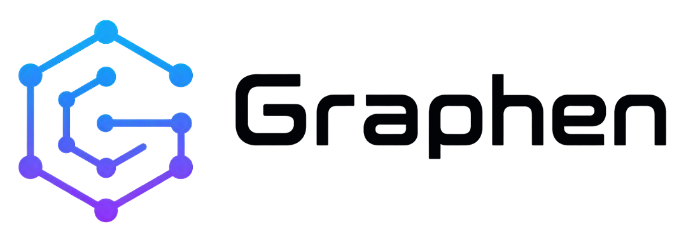

<p align="center">
  <picture>
    <source media="(prefers-color-scheme: dark)" srcset="public/logo-text-dark.png">
    <source media="(prefers-color-scheme: light)" srcset="public/logo-text-light.png">
    
  </picture>
</p>

<p align="center">
  <em>Visual workspace and declarative modeling language for Agent Architecture Language (AAL).</em>
</p>

<p align="center">
  <a href="https://github.com/graphen-studio/graphen/actions/workflows/deploy.yml"></a>
  <a href="https://github.com/graphen-studio/graphen/blob/main/LICENSE"></a>
  <a href="https://www.typescriptlang.org/"></a>
  <a href="https://react.dev/"></a>
  <a href="https://vite.dev/"></a>
  <a href="https://graphen-studio.github.io/graphen/studio/"></a>
</p>

---

## Overview

**Graphen Studio** is a browser-based visual workspace designed to model, inspect, and document multi-agent architectures. By pairing a code editor with an interactive React Flow canvas, Graphen transforms declarative YAML definitions written in **Agent Architecture Language (AAL)** into clear, navigable system graphs in real time.

Instead of maintaining static diagrams that drift from implementation, Graphen lets you define models, agents, tools (MCPs), guardrails, memory, and orchestration topologies as version-controlled code.

## Live Demo

- **Landing Page**: [graphen-studio.github.io/graphen/](https://graphen-studio.github.io/graphen/)
- **Graphen Studio**: [graphen-studio.github.io/graphen/studio/](https://graphen-studio.github.io/graphen/studio/)
- **Documentation**: [graphen-studio.github.io/graphen/docs/](https://graphen-studio.github.io/graphen/docs/)

## Features

- **Real-Time Visual Synchronization**: Edits in the Monaco YAML editor propagate to the React Flow canvas with a 300 ms debounce.
- **Fail-Safe Editing**: Syntax or reference errors display non-blocking diagnostics in the editor while preserving the last valid architecture on the canvas across sessions.
- **Automatic Hierarchical Layout**: Powered by Dagre, groups and interconnected agent nodes automatically organize with customizable layout orientations (top-to-bottom, left-to-right).
- **First-Class Agentic Primitives**: Built-in support for agents, foundation models, Model Context Protocol (MCP) tool endpoints, memory stores, and guardrails.
- **Component Inspector**: Double-click a node on the canvas to inspect its metadata and configuration properties.
- **High-Resolution Export**: Export canvas representations directly to 2x resolution PNG or scalable vector graphics (SVG) for architecture reviews and documentation.
- **Local Persistence**: Code and canvas states persist automatically in browser local storage.

## AAL Specification Example

Create or edit an `.aal.yaml` file to define an architecture:

```yaml
version: "1.1"
metadata:
  name: "Support Orchestrator"
  description: "A multi-agent customer support architecture."
  owner: "Platform Architecture"

models:
  - id: sonnet
    provider: "anthropic"
    model: "claude-sonnet-4-5"
  - id: gpt_4o
    provider: "openai"
    model: "gpt-4o"

groups:
  - id: technical_support
    name: "Technical Support"
    description: "Investigation and knowledge retrieval."

agents:
  - id: supervisor
    name: "Triage Supervisor"
    role: "Routes incoming requests"
    version: "1.0"
    model: sonnet
    tools: [classifier]
    guardrails: [pii_filter]
  - id: specialist
    group: technical_support
    name: "Technical Agent"
    role: "Resolves complex issues"
    model: gpt_4o
    tools: [customer_db]
    memory: [knowledge_base]

mcps:
  - id: customer_db
    group: technical_support
    name: "Customer DB"
    protocol: "mcp/v1"
    endpoint: "https://mcp.example.com/customers"

memories:
  - id: knowledge_base
    group: technical_support
    name: "Knowledge Base"
    provider: "Qdrant"
    mode: "RAG"

tools:
  - id: classifier
    name: "Intent Classifier"
    mechanism: "function"

guardrails:
  - id: pii_filter
    name: "PII Masking"
    mechanism: "pattern-matching"

topology:
  - from: supervisor
    to: specialist
    label: "Delegates"
  - from: supervisor
    to: classifier
    label: "Classifies intent"
  - from: specialist
    to: customer_db
    label: "Queries customer data"
```

Agent references such as `tools: [classifier]` describe dependencies; `topology` defines the connections shown on the canvas. For every field and validation rule, see the [AAL documentation](https://graphen-studio.github.io/graphen/docs/).

## Create architectures with a coding agent

The repository includes an [AAL architecture skill](skills/aal-architecture/SKILL.md) that teaches coding agents how to create `.aal.yaml` files: select components, define model and tool references, add the desired `topology`, and check IDs against the language rules. It includes a complete starting example and points to the [AAL schema](src/core/types/aal.schema.ts) as the source of truth.

Give your agent the `SKILL.md` file or add the `skills/aal-architecture/` folder to the skills location supported by your agent tool. Skill installation and automatic discovery vary by tool. Describe the architecture you want, then paste the generated YAML into [Graphen Studio](https://graphen-studio.github.io/graphen/studio/) to inspect it visually.

## Getting Started

### Prerequisites

- **Node.js**: version 22.0.0 or higher
- **npm**: version 10.0.0 or higher

### Installation

Clone the repository and install dependencies:

```bash
git clone https://github.com/graphen-studio/graphen.git
cd graphen
npm ci
```

### Running Locally

Start the Vite development server:

```bash
npm run dev
```

The application provides three entry points:
- **Landing Page**: `http://localhost:5173/graphen/`
- **Studio Editor**: `http://localhost:5173/graphen/studio/`
- **Documentation**: `http://localhost:5173/graphen/docs/`

### Available Scripts

| Command | Description |
| :--- | :--- |
| `npm run dev` | Starts the Vite local development server with HMR |
| `npm test` | Runs the test suite using Vitest |
| `npm run lint` | Runs ESLint across TypeScript and React source files |
| `npm run build` | Validates TypeScript (`tsc -b`) and produces production bundles in `dist/` |
| `npm run preview` | Locally previews the production build |

## Architecture and Core Modules

- **Parser (`src/core/parser/aalParser.ts`)**: Parses YAML input using `js-yaml` and enforces strict structural and cross-reference validation via Zod schemas (`src/core/types/aal.schema.ts`). Emits structured `AalParseError` exceptions with exact line pointers.
- **Graph Transformer (`src/core/parser/graphTransformer.ts`)**: Converts validated AAL documents into React Flow nodes and edges, grouping nested structures and computing positions with `@dagrejs/dagre`.
- **State Management (`src/store/useStudioStore.ts`)**: Manages document synchronization, active layouts, selection states, and `localStorage` persistence.
- **Vite Configuration (`vite.config.ts`)**: Builds the landing, Studio, and documentation pages under the `/graphen/` GitHub Pages base path.

## Deployment

The project is continuously deployed to GitHub Pages via GitHub Actions upon pushes to the `main` branch.

To configure your fork:
1. Navigate to **Settings** > **Pages** in your repository.
2. Under **Build and deployment**, set **Source** to **GitHub Actions**.

## License

This project is licensed under the MIT License. See the [LICENSE](LICENSE) file for details.
